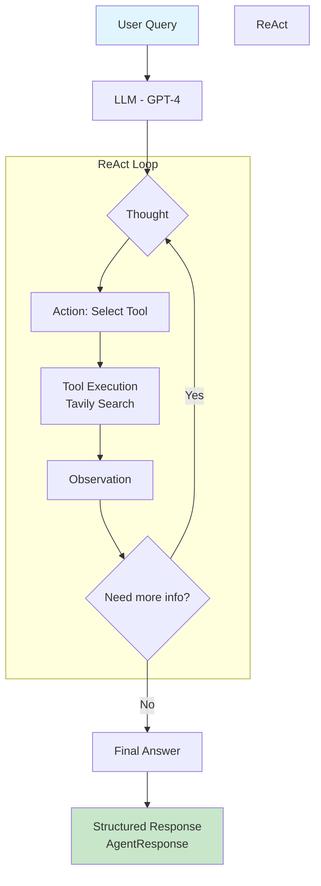
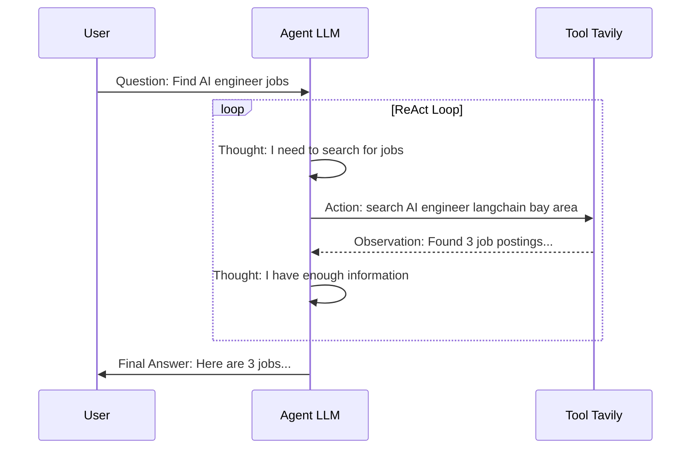

# ReAct Search Agent - Step by Step Tutorial

This branch demonstrates how to **gradually build a ReAct (Reasoning + Acting) agent** using LangChain. Each commit introduces a new concept, showing you the evolution from a basic agent to a modern, production-ready implementation.

## What is ReAct?

ReAct is an agent architecture that combines **reasoning** (thinking about what to do) with **acting** (executing tools). The agent follows a loop:

```
Question → Thought → Action → Observation → ... → Final Answer
```

## Commit Progression

Follow the commits in order to learn how to build a ReAct agent step by step:

| # | Commit | Description | Key Concepts |
|---|--------|-------------|--------------|
| 1 | `151040b` - **react search agent** | Basic ReAct agent setup using LangChain Classic with Tavily search tool | - Project initialization with `uv`<br>- `create_react_agent` from langchain-classic<br>- Using `hub.pull()` for the standard ReAct prompt<br>- `AgentExecutor` for running the agent loop<br>- Tavily search as the tool |
| 2 | `b7d3f9c` - **added output parsing** | Add structured output parsing with Pydantic models | - Custom Pydantic schemas (`AgentResponse`, `Source`)<br>- `PydanticOutputParser` for parsing agent output<br>- Custom ReAct prompt with format instructions<br>- Chaining with `RunnableLambda` to extract and parse output |
| 3 | `cc7b496` - **refactor output parsing to use structured output** | Replace manual parsing with `with_structured_output` | - `llm.with_structured_output()` method<br>- Cleaner approach to structured responses<br>- Simplified chain without manual parser |
| 4 | `6e20937` - **migrate to langchain v0.1 create_agent API** | Modernize to LangChain v0.1 with new `create_agent` API | - New `create_agent` from `langchain.agents`<br>- Built-in `response_format` parameter<br>- Message-based invocation<br>- Simplified code (~50% reduction) |

## How to Use This Tutorial

### Option 1: Checkout Each Commit
```bash
# Start from the first commit
git checkout 151040b

# Move to the next commit
git checkout b7d3f9c

# Continue through each commit...
```

### Option 2: View Diffs Between Commits
```bash
# See what changed between commits
git diff 151040b b7d3f9c  # Basic → Output Parsing
git diff b7d3f9c cc7b496  # Output Parsing → Structured Output
git diff cc7b496 6e20937  # Structured Output → Modern API
```

## Architecture Overview



### ReAct Loop Explained



## Getting Started

```bash
# Install dependencies
uv sync

# Set up environment variables
cp .env.example .env
# Add your OPENAI_API_KEY and TAVILY_API_KEY

# Run the agent
uv run python main.py
```

## Key Files

| File | Purpose |
|------|---------|
| `main.py` | Main agent implementation |
| `schemas.py` | Pydantic models for structured output |
| `prompt.py` | Custom ReAct prompt template (commits 2-3) |

## Requirements

- Python 3.12+
- OpenAI API key
- Tavily API key
